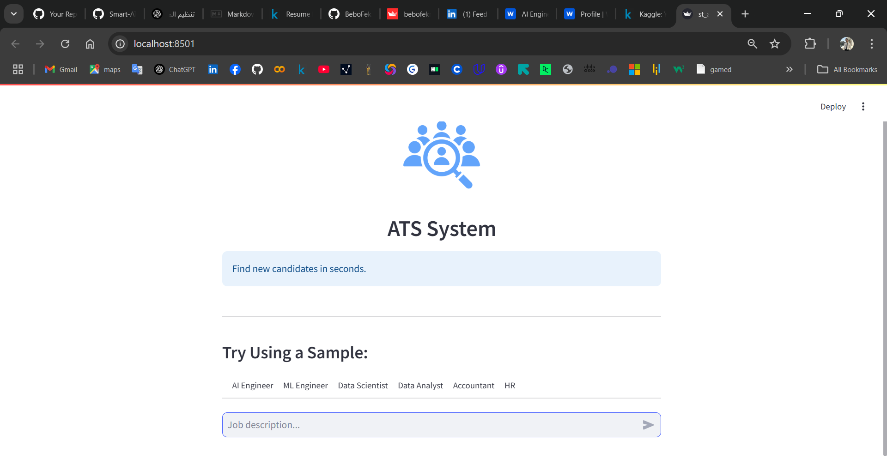
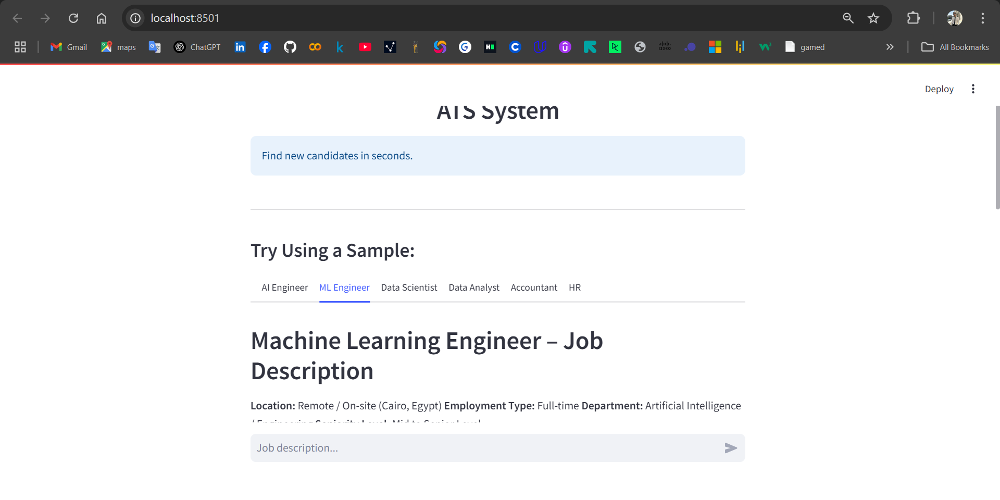
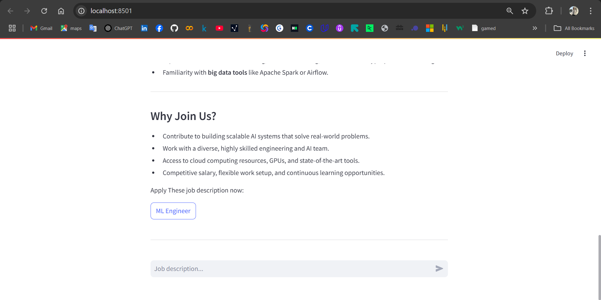
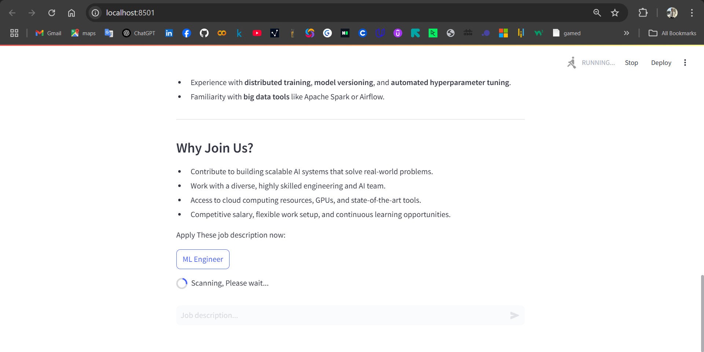
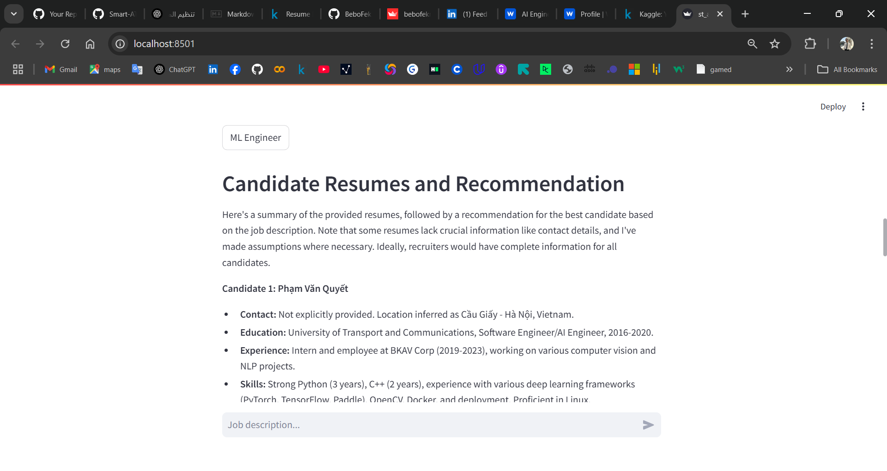
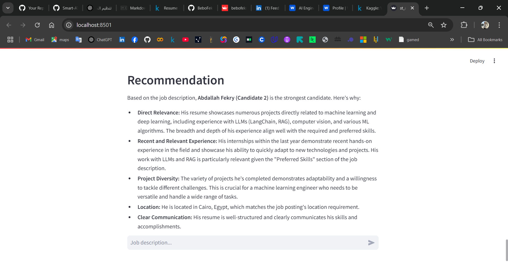

# Smart ATS System using RAG

Smart Applicant Tracking System (ATS) that uses advanced NLP and RAG (Retrieval-Augmented Generation) that can search for the best candidates from a vector database of resumes and recommend the best one using a Large Language Model LLM (Google Gemini)

---


## 📌 Overview

This project enhances the traditional ATS by:
- Parsing and understanding resumes using AI
- Matching resumes with job descriptions
- Answering questions based on stored CV data using a RAG-based QA pipeline

---

## 🧠 Tech Stack

- **Graphical Interface**: Streamlit
- **Backend**: Python
- **Vector Store**: ChromaDB
- **LLM**: Google Gemini
- **Embeddings**: `sentence-transformers`
- **Other Libraries**: pandas, langchain, sentence_transformers.

---

## 📂 Project Structure

```
Smart-ATS/
├── .streamlit/ # Streamlit config files
├── Data/ # Data-related folders
│ ├── job_description/ # Sample or scraped job description texts
│ └── vector_db/ # Vector database files (Chroma DB)
├── images/ # Visual assets and screenshots
├── notebooks/ # Jupyter notebooks for experimentation
├── .gitattributes # Git settings
├── README.md # Project documentation
├── Retriever.py # Core retrieval logic for RAG
├── requirements.txt # Python dependencies
└── st_app.py # Streamlit app entry point
```

---

## 🚀 Getting Started

### 🔧 Prerequisites

Install required packages:

`pip install -r requirements.txt`

Run the app:

`streamlit run st_app.py`

---

## Screenshots








---

## Resources:

[huggingface pdf resumes dataset](https://huggingface.co/datasets/d4rk3r/resumes-raw-pdf)

[Kaggle pdf resumes dataset](https://www.kaggle.com/datasets/snehaanbhawal/resume-dataset?resource=download)

---

## Contact

Developed by Abdallah Fekry

📧 abdallahfekry95@gmail.com
🌐 [LinkedIn](https://www.linkedin.com/in/abdallah-fekry) | [GitHub](https://github.com/BeboFekry?tab=repositories)
